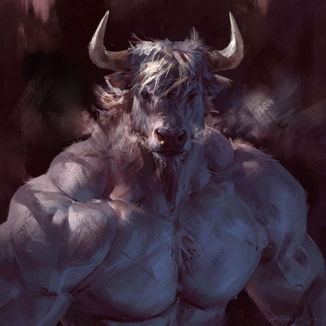
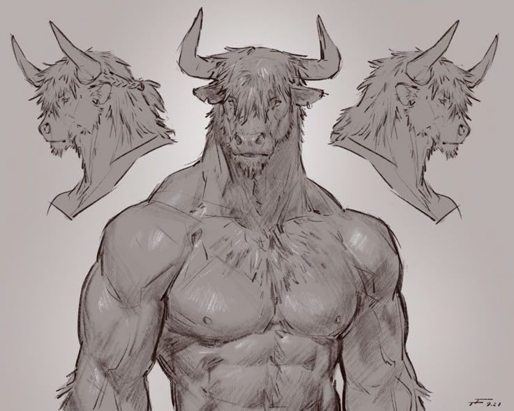

# Mellathor

> Minotaur Knight — "only a strong Minotaur is worth living."

## Stats

| Field | Value |
| --- | --- |
| **Name** | Mellathor |
| **Race / Species** | Minotaur |
| **Age** | 48 (a Minotaur can live to ~150) |
| **Circles** | Knight Body C1–C2 |
| **Path** | Knight (Body) |
| **Status** | ALIVE |
| **Role / Class** | Knight (Body) — frontline brawler / tank |

## Appearance

- 6'3", bulky bull-muscle frame; grey-blue skin with grey fur; battle scars across the torso.
- A thick **minotaur tail** for balance.
- **Bull-horns** — one **cut in half**: he lost the lower half of his **left horn in Tower 5**, where he was hunted for his horns.
- **Portrait:**  · 

## Personality & Motivation

- **Disciplined & controlled** — strict routine: early mornings, high-protein diet, sleep. Calm outside of combat, controlled inside it.
- **Hot-tempered only around other Minotaurs** — sees them as "pathetic," especially the weaker ones; views **Tower 4 dwellers as worthless**.
- **Minotaur values** — strength above all; "only a strong Minotaur is worth living."
- **Combat style (Knight Body):** brute force, charge attacks, **horn headbutts**, and **tail lashing**.
- **Moral conflict:** he believes in strength, yet he was in **self-defense** when it happened.

## Background & Lore (canon)

- From **Tower 7**; raised by his father **Goliath** alongside his brother **Brutus**.
- Goliath taught them to compete — **violence as bonding**. He told Mellathor, *"Only a strong Minotaur is worth living."*
- **The crime (self-defense):** an attack on him turned to **accidental killing** — in the rage of the fight, he killed an **innocent citizen** who had nothing to do with it.
  - **The victim's identity is intentionally vague — to be revealed in a future session.**
- Has moved **between Tower 7 and Tower 6** before; other Minotaurs have supposedly moved elsewhere.

## Connections

- **Goliath** (father) — [neutral / respected] The Minotaur who raised him and set his creed.
- **Brutus** (brother) — [rival] Raised together; strength as the only measure of worth.
- **Tower 4 Minotaurs** — [dismissive] He sees them as weak and "pathetic."

## Session Status (current state)

- **Hardlight bridge (Session 1, canon)** — the party's first meeting with [Jordan](../NPCs/Jordan.md). Mellathor fought [Zim](../NPCs/Zim.md) and the unnamed:
  - **Kicked Zim in the face and sent him crashing into [Yuntao](Yuntao.md)** — leaving a **hoof print** on Zim's face. (Yuntao then burned that hoof print deeper into Zim's face and seared his vocal cords — see [Zim](../NPCs/Zim.md).)
  - **Stomped Jordan's third, unnamed human companion (a thief) dead** — a direct kill, separate from the accidental self-defense killing that got him imprisoned.
- **Beef with Yuntao** over [Yuntao's grafted arm](Yuntao.md).

## Open Threads / Ideation

- **MELLATHOR IS RACIST?** — open question from session notes: hostile toward non-Minotaurs; he was involved in a "thing against people from Tower 5." (Flag for the DM — not yet resolved.)
- **Who was the innocent citizen** he accidentally killed in self-defense? (deliberately held back for a future reveal)
